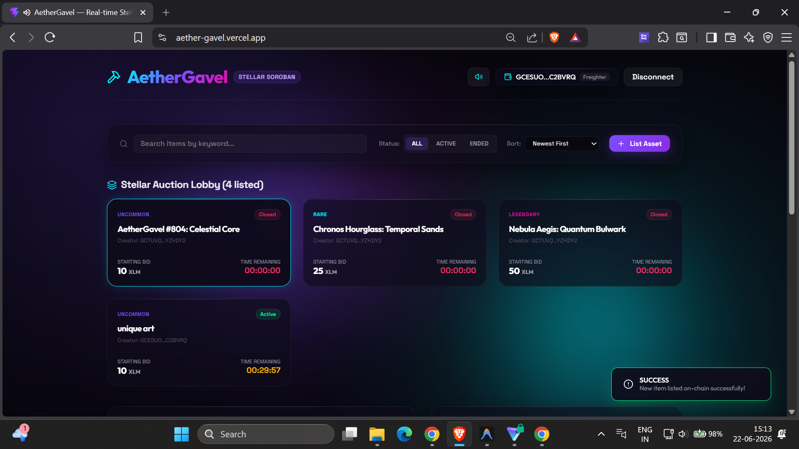
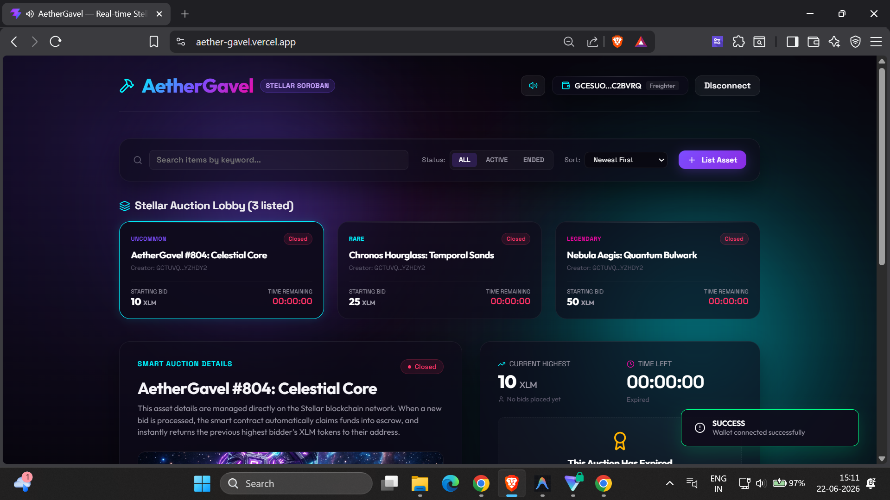
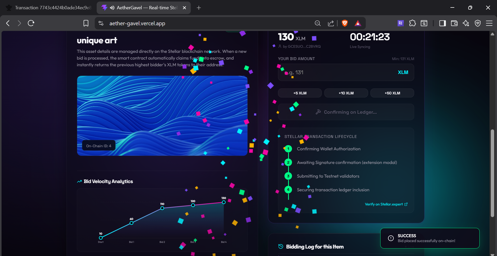
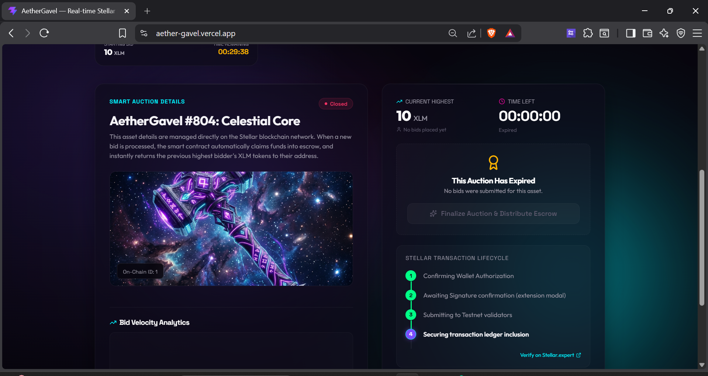
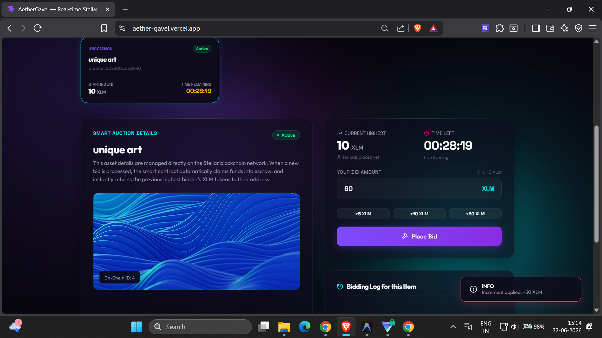
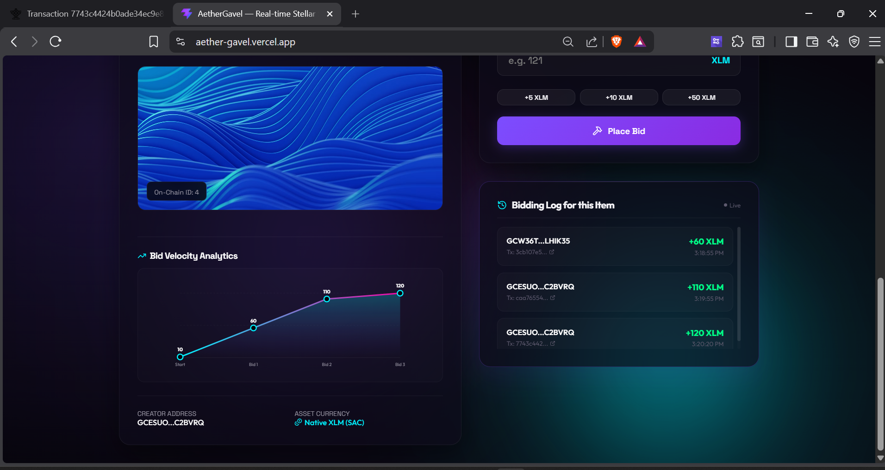
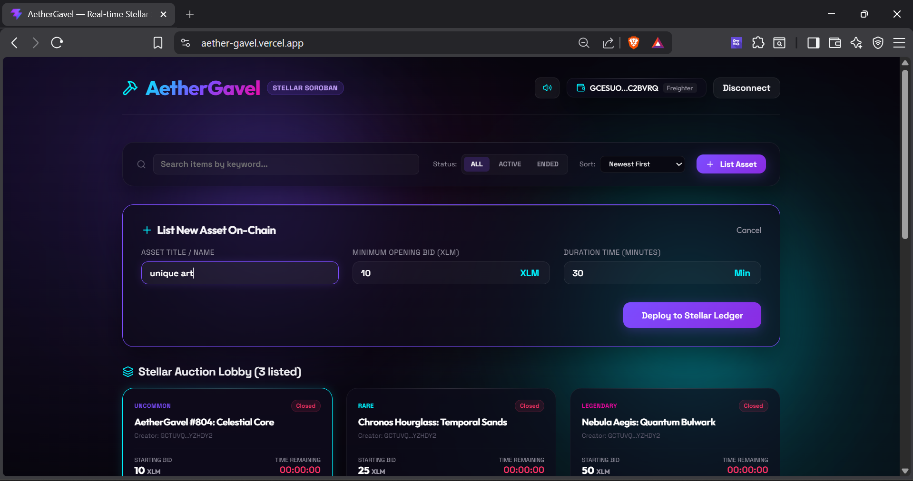

# AetherGavel ✦ Stellar Soroban Smart Auction Portal

**AetherGavel** is a premium, real-time decentralized bidding and auction application built on the **Stellar Soroban Smart Contract Platform**. It provides a sleek, glassmorphic dark-theme interface that connects multiple browser extension wallets, tracks contract state through transaction simulation, and streams ledger event logs in real-time.

---

## 🚀 Verifiable Testnet Deployment

The smart contract is compiled, deployed, initialized, and seeded on the **Stellar Testnet**:

*   **Smart Contract Address:** `CDV2KGOMMSSYWAKGO3ZOVUKB5ADNAJVSYFAB4TJI42NE73WKHHVSYXJB`
    *   *Verify on Stellar.expert:* [Stellar Explorer Contract Link](https://stellar.expert/explorer/testnet/contract/CDV2KGOMMSSYWAKGO3ZOVUKB5ADNAJVSYFAB4TJI42NE73WKHHVSYXJB)
*   **WASM Upload Transaction Hash:** `aa49fc19cae0a638dab1f9d9386f9f9964faab8022323f661269d3751af21805`
    *   *Verify on Stellar.expert:* [WASM Upload Tx Details](https://stellar.expert/explorer/testnet/tx/aa49fc19cae0a638dab1f9d9386f9f9964faab8022323f661269d3751af21805)
*   **Contract Instantiation Transaction Hash:** `290af384368b3ec83d1ef4c9a1e431388d283fb30dfaea9c53d62d78fd1d9394`
    *   *Verify on Stellar.expert:* [Instantiation Tx Details](https://stellar.expert/explorer/testnet/tx/290af384368b3ec83d1ef4c9a1e431388d283fb30dfaea9c53d62d78fd1d9394)
*   **Contract Initialization (`initialize`) Transaction Hash:** `679c2e1dd5d7b09c2279513c680aaf3d895df592cb36a15cb8ac2d136df69f03`
    *   *Verify on Stellar.expert:* [Initialization Tx Details](https://stellar.expert/explorer/testnet/tx/679c2e1dd5d7b09c2279513c680aaf3d895df592cb36a15cb8ac2d136df69f03)

### Seeded Items (Default State)
Three default items have been successfully listed on-chain for verification:
1.  **AetherGavel #804: Celestial Core** (10 XLM opening bid, Tx: `10c07331a23dfd18c7fcce765d24d38d5336a4c9aa8df3cdca1f1d1200b4dc19`)
2.  **Chronos Hourglass: Temporal Sands** (25 XLM opening bid, Tx: `9bff006a06c3e35e61edab70824902923c0549968d8d0882aa943754876fc712`)
3.  **Nebula Aegis: Quantum Bulwark** (50 XLM opening bid, Tx: `92a0f019d7aaf885a87edbe059e6f185599b53eb8a01eb17d24f5b47569a9435`)

---

## 🛡️ Core Features & Level 2 Requirements Met

### 1. Multi-Item Auction Lobby & Dynamic Listings
*   **On-Chain Grid Lobby:** Users can view all active and ended auctions on the Stellar ledger dynamically.
*   **On-Chain Creation:** Connect your wallet and fill out the "List Asset" form to deploy a new item (with name, starting bid, and duration) on the Stellar testnet. It updates the lobby grid in real-time.
*   **Preset Bidding Increments:** Fast quick-clicks to add `+5 XLM`, `+10 XLM`, or `+50 XLM` relative to the current bid.

### 2. Premium UX Aesthetics
*   **Web Audio API Synth:** Programmatic audio sound effects (happy upward tones on wallet connect, high chimes on successful bid, and deep buzzers on error) that work without static files.
*   **Interactive Confetti Canvas:** High-performance vector confetti bursts on successful bid placement or finalization claims.
*   **Dynamic SVG Price Chart:** Evaluates transaction event history and plots a gradient trading line chart of bid velocity/progression for each active item.

### 3. Multi-Wallet Integration
Uses `@creit.tech/stellar-wallets-kit` to support multiple browser wallets under a single static connector interface:
*   **Freighter** (Stellar Development Foundation)
*   **Albedo**
*   **xBull**
*   **Hana Wallet**

### 4. Smart Contract Called from Frontend
*   **Read State:** The application polls all items from the contract's `get_all_auctions` method via gas-free RPC simulation (`simulateTransaction`).
*   **Write State:** Bidders submit bids via the contract's `bid` method, which is simulated, signed by the browser wallet, and submitted.

### 5. Real-Time Event Listening & State Synchronization
*   The contract publishes a `bid_placed` event with the item ID, bidder, and amount.
*   The frontend polls the Soroban RPC `getEvents` endpoint and logs activities dynamically.

### 6. Transaction Status & Explorer Link Visibility
An interactive **Transaction Lifecycle Tracker** shows the state machine progression in real-time:
`Connecting Wallet` ➔ `Awaiting Signature` ➔ `Submitting to Testnet` ➔ `Confirming Execution` ➔ `Success / Error`.
Clickable hyperlinks to the transaction on `Stellar.expert` are generated.

### 7. 3 Custom Error Types Handled
1.  **Wallet Extension Missing / Not Found:** If a user selects a wallet option but doesn't have the extension installed, a styled notification banner prompts the user with troubleshooting details and installation links.
2.  **User Rejected Connection / Signature:** Gracefully intercepts Freighter/Albedo cancel codes and warns the user with a "Transaction Signature Declined" popup.
3.  **Insufficient Balance / Contract Failures:** Checks if the user's XLM balance is underfunded or if the transaction failed validator criteria, showing precise diagnostics.

---

## 📸 Application Visual Walkthrough

Here is a visual walkthrough of the **AetherGavel** multi-item auction house showcasing the completed features and Level 2 requirements:

### 1. Main Dashboard & Active Lobby Grid
The active item lobby displays all active or finalized smart auctions on-chain with rarity indicators, dynamic listing cards, and countdown timers:


### 2. Connected State & Wallet Integration
Connecting your wallet uses `StellarWalletsKit` supporting Freighter, Albedo, Hana, and xBull:


### 3. Placing an On-Chain Bid
Inputting a bid amount and placing it triggers a transaction simulation, signature, and submission:


### 4. Interactive Transaction Lifecycle
An interactive status timeline tracks the transaction step-by-step from wallet authorization to ledger confirmation:


### 5. Dynamic Bid Velocity Chart
The dashboard automatically plots bid history in a responsive SVG line chart:


### 6. Streaming Real-Time Ledger Events
The real-time log listens to Soroban event logs to synchronize updates and list active bidders:


### 7. Deploying New Items On-Chain
Connected users can list their own custom assets dynamically by completing the "List Asset" form:


### 8. Finalizing and Settling Auctions
When an auction expires, the finalization step distributes the escrow funds to the creator on-chain:


---

## 🛠️ Local Development & Quick Start

Follow these steps to run the application locally:

### Prerequisites
*   Node.js (v18+ or v20+)
*   npm (v9+)
*   Rust / Cargo (Only if compiling the smart contract yourself)

### Installation
1.  Install dependencies:
    ```bash
    npm install
    ```

2.  Run the local development server:
    ```bash
    npm run dev
    ```

3.  Open [http://localhost:5173](http://localhost:5173) in your browser.

---

## 📦 Compilation & Redeployment (Optional)

If you modify the smart contract and wish to compile/redeploy it:

1.  **Compile Rust Contract to WebAssembly:**
    Navigate to the contract directory and build:
    ```bash
    cd contracts/auction
    cargo build --target wasm32-unknown-unknown --release
    ```

2.  **Run the Deployment Script:**
    From the root directory, run the automated script:
    ```bash
    node scripts/deploy.cjs
    ```

---

## ☁️ Vercel Deployment Instructions

Follow these step-by-step instructions to deploy the AetherGavel frontend to Vercel:

### Option A: Vercel CLI (Fastest)
1. Install Vercel CLI globally:
   ```bash
   npm install -g vercel
   ```
2. Run the deployment wizard from the project root:
   ```bash
   vercel
   ```
   * Set the project name as `aethergavel`
   * Keep default settings (Vite build commands are auto-detected as `npm run build` and output directory as `dist`).
3. Deploy to production:
   ```bash
   vercel --prod
   ```

### Option B: GitHub Integration (Recommended)
1. Push your updated code to your GitHub repository:
   ```bash
   git add .
   git commit -m "feat: upgrade AetherGavel to senior multi-item auction house"
   git push origin main
   ```
2. Log into the [Vercel Dashboard](https://vercel.com).
3. Click **Add New** ➔ **Project**.
4. Import your `AetherGavel` repository.
5. In **Build and Development Settings**, Vercel will automatically detect the **Vite** framework preset:
   * Build Command: `npm run build` or `vite build`
   * Output Directory: `dist`
6. Click **Deploy**. Vercel will build and assign a free custom SSL domain (e.g., `aethergavel.vercel.app`) with automatic redeployments on every commit!
